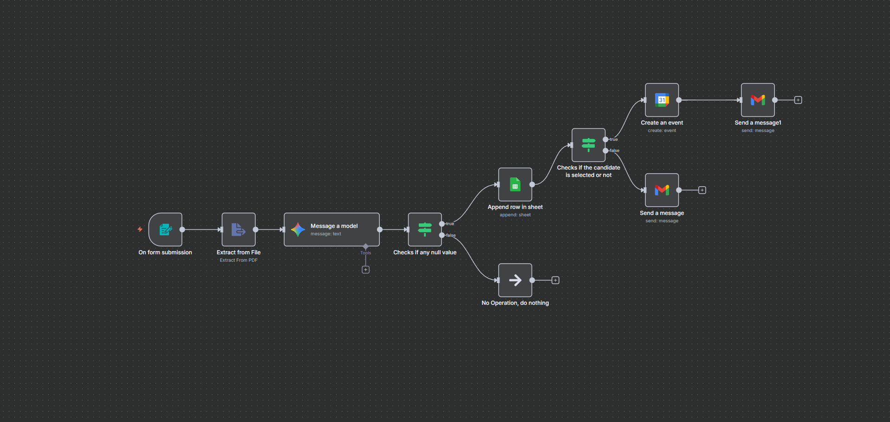

# 📄 Automated Resume Screening & Interview Scheduling using n8n

This project uses **n8n**, an open-source workflow automation tool, to streamline the entire candidate screening process—from resume submission to interview scheduling—powered by **AI** and **Google services**.

---

## 🚀 Project Overview

This workflow:
- Extracts and validates candidate information from form submissions
- Uses an **OpenAI/GPT model** to assess resume content
- Logs candidate data in **Google Sheets**
- Applies logic to select suitable candidates
- Schedules interviews via **Google Calendar**
- Sends personalized notifications through **Gmail**

---

## 🧠 Tech Stack

- 🔄 **[n8n](https://n8n.io/)** – Workflow automation platform
- 🤖 **OpenAI** – AI-driven resume evaluation
- 📄 **PDF Parser** – Resume data extraction
- 📊 **Google Sheets** – Data logging
- 📅 **Google Calendar** – Interview scheduling
- 📧 **Gmail API** – Email automation

---

## 🧪 Key Features

- ✅ AI-powered resume evaluation using OpenAI
- 📋 Auto-validation for incomplete form submissions
- 🧠 Intelligent branching for candidate selection
- 📤 Google Sheet integration for tracking applications
- 📆 Interview scheduling via Google Calendar
- 📬 Personalized Gmail notifications to candidates
- ⚡ Handles **100+ applications per week**

---

## 📂 Project Structure

```bash
Artificial-Evaluation-and-Scheduling-System-for-Candidates/
├── document.txt
├── README.md
└── workflow-visual.png

```

---

## 🖼️ Workflow Screenshot



---

## 🛠️ How to Use

1. **Clone this repo**  
   ```bash
   git clone https://github.com/KrMayank789/Artificial-Evaluation-and-Scheduling-System-for-Candidates.git
   ```

2. **Import Workflow into n8n**
   - Open your n8n instance
   - Click `Import Workflow`
   - Upload `AI_ResumeValidator.json`

3. **Connect Required Credentials**
   - Google Sheets, Calendar, and Gmail API
   - OpenAI API key

4. **Test & Deploy**
   - Run a test submission
   - Check Google Sheet entry and email/calendar response
   - Deploy the workflow (locally, or via n8n cloud/self-hosted)

---

## 📈 Result

This system automated a previously manual hiring workflow, reducing screening time by **80%** and efficiently managing over **100 candidates weekly**.

---

## 📬 Contact

Have suggestions or want to collaborate?  
Feel free to reach out via [LinkedIn](https://www.linkedin.com/in/mayankamrit/) or raise an issue.